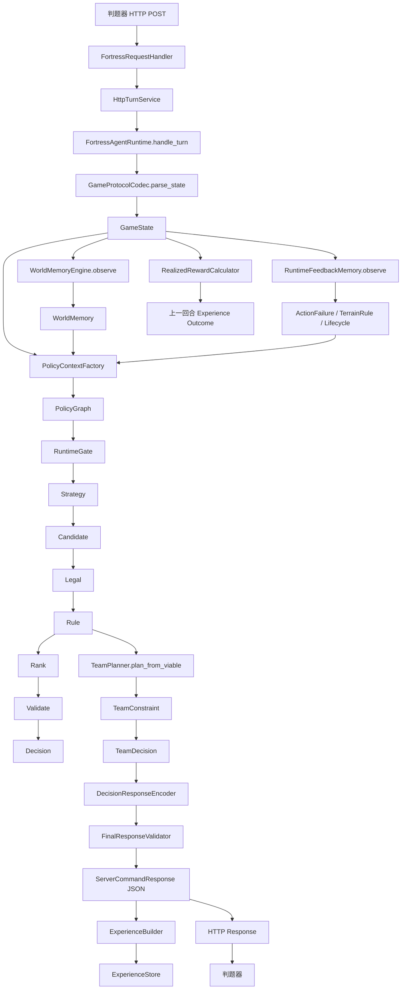

# FortressAgent 项目完整架构说明（V0.5.2）

> 目标：给第一次接触项目的开发者一份可以“从入口一路读到策略输出”的中文说明。文档保留必要英文术语（例如 PolicyGraph、Candidate、Reward、Experience、StrategyGraph），其余尽量使用中文。

---

# 1. 项目目标与核心设计原则

FortressAgent 是一个面向比赛环境的**有状态、多角色、可扩展、强安全约束** Agent。它需要在 5 秒请求响应限制下完成：

- 解析当前世界状态；
- 维护跨回合 WorldMemory；
- 根据正式游戏规则过滤非法动作；
- 生成三个角色的联合动作；
- 记录 Experience/Outcome；
- 根据反馈动态学习规则；
- 在有限 LLM quota 下请求战略建议；
- 在任何异常情况下仍尽可能返回格式合法的 Response。

项目遵循以下设计原则。

## 1.1 Domain / Wire 分离

服务器 JSON 不直接在策略里传播。

```text
Server JSON
    ↓ Protocol Parser
GameState / Domain Action
    ↓ Policy
Decision / TeamDecision
    ↓ Action Mapper + FinalValidator
ServerCommandResponse JSON
```

优点：

- 服务器字段变化集中在 `protocol/`；
- 策略代码只处理稳定 Domain 对象；
- 不会在业务代码中到处出现 JSON key。

## 1.2 Candidate / Legal / Rule / Reward 分层

一个动作“能不能想到”“能不能做”“值不值得做”是不同问题：

```text
Candidate     = 有哪些可考虑动作
Legal         = 官方规则是否允许
Rule          = 当前业务/策略约束是否允许
Reward/Utility= 哪个动作更值得做
```

禁止把所有判断写成一个巨大 `if/else`。

## 1.3 Strategy 与 Policy 分离

- StrategyGraph：较长时间尺度，例如 economy / prepare / defense / task；
- PolicyGraph：单回合如何从状态得到动作。

Strategy 决定“现在优先做什么”；Policy 决定“这一回合具体做什么”。

## 1.4 Memory 与 Logger 分离

```text
Memory = Agent 自己做决策使用的状态
Logger = 人类赛后分析使用的投影
```

日志模式 `compact/full` 绝不能改变 Memory、Experience 或策略行为。

## 1.5 Safety 优先于收益

比赛限制 HTTP 响应时间，且异常次数有限。因此优先级是：

```text
合法且及时的空响应
    >
复杂但超过 5 秒的高收益动作
```

V0.5.2 通过 Internal Deadline + HTTP Outer Watchdog 强制落实这一原则。

---

# 2. 生产入口

比赛只执行项目根目录：

```bash
python main3.py <port>
```

入口链：

```text
main3.py
  ↓
agent.server.serve(...)
  ↓
application.bootstrap.build_runtime(...)
  ↓
server.http.run_http_server(...)
  ↓
HttpTurnService
  ↓
FortressAgentRuntime.handle_turn(...)
```

## 2.1 main3.py 的职责

`main3.py` 只做四类事情：

1. 读取 port；
2. 配置 `sys.path`；
3. 唯一一次 `logging.basicConfig()`；
4. 声明比赛级配置常量并调用 `serve()`。

当前重要参数：

```python
LOG_MODE = "compact"
INTERNAL_DEADLINE_SECONDS = 3.2
HTTP_OUTER_TIMEOUT_SECONDS = 4.2
MOVE_FAILURE_GLOBAL_BAN_ROUNDS = 3
```

原则：`src/` 内禁止新增第二个 `logging.basicConfig()`。

---

# 3. 项目目录职责

```text
src/
├── agent/
│   └── server.py
│       比赛适配层，只负责把 main3 配置注入内部系统
│
└── fortress_agent/
    ├── application/        应用编排层，Runtime 与依赖装配
    ├── candidates/         Candidate Generator
    ├── contracts/          协议依赖型插件契约
    ├── domain/             稳定领域对象
    ├── evaluators/         Action → Utility 评估
    ├── events/             DomainEvent / EventStore
    ├── evolution/          Shadow / Promotion / Rollback
    ├── features/           PolicyContext 特征
    ├── game_rules/         官方规则的权威实现
    ├── learning/           Experience / Learner / PolicyPatch
    ├── llm/                Prompt / Parser / Coordinator
    ├── memory/             World / Feedback / Strategic Memory
    ├── observability/      Trace / IO / Logger / Replay
    ├── observation/        State → Memory 更新
    ├── policy/             PolicyGraph / Legal / Rank / TeamPlanner
    ├── protocol/           Server JSON ↔ Domain/Wire
    ├── reward/             Expected/Realized Reward
    ├── rules/              可插拔业务 Rule
    ├── safety/             Deadline / Emergency / LLM Budget
    ├── server/             HTTP server
    ├── strategies/         StrategyGraph
    └── world/              Traversability / A* / Occupancy / Threat
```

---

# 4. 一次完整回合的数据流

下面是项目最重要的数据流。



下面按实际执行顺序详细解释。

---

# 5. HTTP 层

## 5.1 `server/http.py`

关键类：

```text
FortressRequestHandler
HttpTurnService
CompetitionThreadingHTTPServer
```

### FortressRequestHandler

职责非常薄：

```text
读取 Content-Length
    ↓
读取 body
    ↓
service.handle(body)
    ↓
写 HTTP status/header/body
```

这里不允许出现业务策略。

### HttpTurnService

负责 HTTP 安全边界：

```text
请求体大小限制
Runtime 单 worker
4.2s outer watchdog
busy fallback
异常 fallback
BrokenPipe 清理
```

V0.5.2 以后，Runtime 在线程池的单 worker 中运行，HTTP handler 不再依赖 `asyncio.wait_for` 对同步 CPU 逻辑进行强制中断。

### BrokenPipe

如果客户端已经断开：

```text
BrokenPipeError / ConnectionResetError
```

不会继续抛给 socketserver，而是记录：

```text
response_not_delivered
```

并调用：

```python
runtime.abandon_undelivered_response(correlation_id)
```

---

# 6. Runtime：全系统总编排器

文件：

```text
application/runtime.py
```

类：

```python
FortressAgentRuntime
```

它不应该包含大量具体业务规则，而负责“按正确顺序调用各层”。

核心顺序：

```text
1. Parse
2. Feedback
3. WorldMemory
4. Realized Reward / Outcome
5. Long-horizon information
6. PolicyContext
7. PolicyGraph
8. LLM prompt planning
9. TeamPlanner
10. Encoder + FinalValidator
11. Experience commit
12. Trace / IO journal
```

## 6.1 Runtime 的跨回合状态

```text
_previous_state
_pending_experiences
_turn_sequence
WorldMemory
RuntimeFeedbackMemory
StrategicMemory
PolicyRepository
ExperienceStore
LLMBudgetTracker
```

这些状态说明 Runtime 不能并发执行两个回合，所以 HTTP 层只允许一个 Runtime worker。

## 6.2 Deadline fallback

Runtime 的内部预算不足时调用：

```python
_deadline_fallback(...)
```

返回：

```json
{"roleCommandMap":{},"prompt":"","executeCmd":""}
```

并且不产生本轮 pending Experience。

---

# 7. Protocol 层

目录：

```text
protocol/
```

主要职责：

```text
Server JSON
↔
Domain State / Action
↔
Server Response JSON
```

关键文件：

| 文件 | 作用 |
|---|---|
| `server_inbound.py` | 官方 Request schema |
| `server_outbound.py` | 官方 Response schema |
| `codec.py` | JSON decode/encode |
| `builder.py` | wire object → GameState |
| `action_mapper.py` | Domain Action → RoleCommand |
| `final_validator.py` | 最终发送前硬校验 |
| `safe_outbound.py` | 单角色 fallback |

## 7.1 Inbound 宽容，Outbound 严格

Inbound 原则：

```text
允许服务器增加未知字段
```

Outbound 原则：

```text
只发协议允许字段
字段数量、targetPos、controllerId 等严格校验
```

---

# 8. Domain 层

目录：

```text
domain/
```

这是业务层最稳定的模型。

主要对象：

```text
GameState
Position
CharacterState
BuildingState
ResourceState
TaskState
Action subclasses
Decision
TeamDecision
PolicyState
RewardBreakdown
UtilityBreakdown
```

策略代码应依赖 Domain，而不是依赖 Pydantic wire model。

---

# 9. WorldMemory

目录：

```text
memory/
observation/
events/
```

## 9.1 WorldMemory

负责“世界目前是什么样”。

例如：

```text
哪些格子已观察
资源在哪里
资源是否 available/depleted
地图 terrain
访问次数
```

输入来源：

```text
GameState
    ↓
WorldMemoryEngine.observe
    ↓
DomainEvent
    ↓
Projector
    ↓
WorldMemory
```

## 9.2 Event Store

抽象类：

```python
EventStore
```

实现：

```text
InMemoryEventStore
JsonlEventStore       # local/offline
JournaledEventStore   # production wrapper
```

生产环境真实状态保存在内存；Journaled 包装只把人类需要的信息投影到 root logger。

---

# 10. RuntimeFeedbackMemory

文件：

```text
memory/feedback.py
```

它和 WorldMemory 不同。

WorldMemory 回答：

> 世界里有什么？

FeedbackMemory 回答：

> 服务器告诉我们上一动作成功还是失败？从失败中学到了什么规则？

主要内容：

```text
lastRoundRoleActionResults
lastSummonTreasureResult
lastCmdResult
server_errors
ActionFailureLesson
CommandErrorLesson
TerrainRule
```

## 10.1 MOVE 失败短期保护

```text
某角色 MOVE(x,y) = false
    ↓
全角色短期禁止 MOVE(x,y)
```

这是 temporary guard。

## 10.2 Terrain type 长期规则

严格证据链：

```text
上一回合我们确实发送 MOVE(x,y)
+
lastRoundRoleActionResults[role] = false
+
收到的 server_errors 中存在同 role/action/target 的 impassable terrain [T]
    ↓
TerrainRule(T, traversability=impassable)
```

长期 key 是 `terrain_type`，坐标只作为 evidence。

## 10.3 规则生命周期

状态：

```text
ACTIVE
DORMANT
RETIRED
```

只有 ACTIVE 影响当前决策。

注意：正式规则已经确认 4 个 TaskPoint 是永久物理障碍，因此 TaskPoint terrain 应作为 global physical obstacle，而不是随任务内容失效变可走。

---

# 11. World / Traversability / Pathfinding

目录：

```text
world/
```

## 11.1 TraversabilityMap

它回答：

```text
这个坐标现在是否可以作为 MOVE target？
```

综合：

```text
地图边界
资源
TaskPoint
Vendor / WeaponShop
己方/敌方建筑
角色
机器人
learned TerrainRule
team-wide temporary retry guard
```

## 11.2 AStarPathfinder

正式规则是：

```text
8 方向移动
Chebyshev distance
正交/对角都消耗 1 回合
两个正交障碍不会阻止对角穿越
```

V0.5.2 的 `find_path_to_any` 是 Multi-goal A*：多个 access cell 只跑一次搜索。

---

# 12. Game Rules 权威内核

目录：

```text
game_rules/
```

这里应该存放**官方规则事实**，不要存策略偏好。

主要文件：

```text
geometry.py      Chebyshev、8邻域、角度
catalog.py       武器/商店/建筑基础数据
constants.py     常量
tasks.py         TaskPoint 语义
build_area.py    0/1/2 Station build ring
feedback.py      反馈分类
scoring.py       积分规则
```

原则：

```text
“Rocket 第一座优先”不是 game rule；
“Rocket 建造 25 gold”才是 game rule。
```

前者应进入 Reward/Strategy，后者进入 game_rules。

---

# 13. Candidate 层

抽象类：

```python
CandidateGenerator
```

文件：

```text
candidates/base.py
```

实现分布：

```text
basic.py
navigation.py
business.py
```

Candidate 的职责只回答：

> 当前状态下，有哪些动作值得进入后续过滤？

它不能保证动作最终会发送。

## 13.1 实现映射

| Candidate | 实现 |
|---|---|
| Move | `MoveCandidateGenerator` |
| Explore | `ExplorationCandidateGenerator` |
| Gather | `GatherCandidateGenerator` |
| Resource Approach | `ResourceApproachCandidateGenerator` |
| Attack | `AttackCandidateGenerator` |
| Task Approach | `TaskApproachCandidateGenerator` |
| Vendor Approach | `VendorApproachCandidateGenerator` |
| WeaponShop Approach | `WeaponShopApproachCandidateGenerator` |
| Base Return | `BaseReturnCandidateGenerator` |
| Sell/Buy/Use | `business.py` |
| Build | `BuildCandidateGenerator` |
| Accept/Submit | `business.py` |
| Treasure | `business.py` |

所有 Generator 在：

```python
application/basic_policy.py::build_basic_policy_runtime
```

注册。

---

# 14. Legal 层

文件：

```text
policy/legal.py
```

职责：

> 根据官方游戏规则，过滤确定不能发送的动作。

例如：

```text
MOVE target 不可通行
Worker-only action
day/night 限制
build area
金币/背包基本条件
attack controller 邻接
weapon range
cooldown
```

Legal 是早期过滤，但不是最终安全边界。

---

# 15. Rule 层

抽象类：

```python
Rule
```

实现：

```text
rules/basic.py
```

Rule 用于可插拔业务约束，例如：

```text
GatherOnlyDuringDayRule
GatherWorkerOnlyRule
```

如果是“协议/官方游戏必然非法”，优先放 Legal/FinalValidator；如果是“我们自己的业务策略约束”，才放 Rule。

---

# 16. Reward / Evaluator / Utility

这三个概念必须区分。

## 16.1 ExpectedRewardModel

抽象类：

```python
ExpectedRewardModel
```

实现：

```text
reward/models.py
reward/navigation.py
reward/business.py
```

它估计：

```text
position
combat
resource
score
survival
action_cost
risk
...
```

## 16.2 ActionEvaluator

抽象类：

```python
ActionEvaluator
```

实现：

```text
evaluators/basic.py
evaluators/navigation.py
evaluators/business.py
```

Evaluator 找到适合 Action 的 RewardModel，然后组合成 Utility。

## 16.3 UtilityComposer

最终 Utility 可能应用 StrategyProfile 的权重。

因此：

```text
Reward = 世界/动作层预期结果
Utility = 当前策略下对 Reward 的偏好解释
```

---

# 17. PolicyGraph

抽象节点：

```python
PolicyNode
```

参考实现位置：

```text
policy/graph/reference.py
```

节点顺序：

```text
RuntimeGate
  ↓
Strategy
  ↓
Candidate
  ↓
LegalFilter
  ↓
Rule
  ↓
Rank
  ↓
Validate
  ↓
Finalize
```

失败分支统一可进入：

```text
Emergency
```

关键设计：

```text
Node 只返回 outcome
Graph topology 决定 next node
```

例如 CandidateNode 只返回：

```text
available / empty
```

它不知道下一步是 Legal 还是 Emergency。

---

# 18. StrategyGraph

目录：

```text
strategies/
```

抽象类：

```text
StrategyNode
StrategyActivator
```

参考实现：

```text
strategies/reference.py
```

Activator：

```text
NightActivator
PrepareActivator
ActiveTaskActivator
DayDefaultActivator
```

StrategyNode：

```text
FixedProfileNode
LongHorizonDecisionNode
```

StrategySessionStore 保存跨回合临时进度，但它不是 PolicyState。

区别：

```text
PolicyState
= 可学习、版本化参数

StrategySession
= 当前多回合计划的临时黑板
```

---

# 19. TeamPlanner 与 TeamConstraint

TeamPlanner 负责：

```text
把 viable_actions 按 actor 分组
    ↓
每个 actor Rank
    ↓
形成多个 Decision
    ↓
TeamConstraintRegistry
    ↓
TeamDecision
```

V0.5.2 以后 TeamPlanner 使用：

```python
plan_from_viable(...)
```

直接复用 PolicyGraph 已有结果。

## 19.1 TeamConstraint 抽象类

实现均在：

```text
policy/team_constraints.py
```

当前包括：

```text
UniqueActorConstraint
WeaponControllerConstraint
GoldBudgetConstraint
InventoryConsumptionConstraint
UniqueBuildTargetConstraint
WeaponBuildLimitConstraint
WallBuildLimitConstraint
JointMoveCollisionConstraint
```

联合动作规则尽量新增 Constraint，不要把特殊逻辑写进 TeamPlanner。

---

# 20. BuildAreaPolicy

抽象接口：

```python
BuildAreaPolicy
```

生产实现：

```python
StationDefenseBuildAreaPolicy
```

正式模板：

```text
222222
211112
210012
210012
211112
222222
```

定义：

```text
0 = 2x2 Station footprint
1 = Weapon build zone
2 = Wall build zone
```

使用 Chebyshev distance 到 Station footprint 动态计算，因此上下半场换边无需手工改绝对坐标。

---

# 21. FinalResponseValidator：最后一道硬安全边界

文件：

```text
protocol/final_validator.py
```

它是“真正发给服务器前”的最后过滤层。

设计原则：

```text
Candidate 错了 → FinalValidator 仍必须挡住
Legal 漏了 → FinalValidator 仍必须挡住
Plugin 绕过 Candidate → FinalValidator 仍必须挡住
```

所以重要的官方硬规则最好具备多层防御：

```text
Candidate
Legal
FinalValidator
```

但三层应调用同一 `game_rules`/Policy 数据源，而不是复制常量。

---

# 22. Emergency Policy

文件：

```text
safety/emergency.py
```

实现：

```python
BasicEmergencyPolicy
```

Emergency 不代表绕过规则。

它仍使用：

```text
TraversabilityMap
FeedbackMemory
8-neighbor official rules
```

白天优先选择明确合法的 collect，否则选择确定可通行的 MOVE；如果完全没有安全动作，则上层可以返回空 `roleCommandMap`。

---

# 23. Experience / Outcome / Learner

## 23.1 Experience

代表：

> Agent 在某状态下准备发送了什么动作，以及当时为什么认为它有价值。

字段包括：

```text
feature_vector
strategy_id
action
predicted_utility
policy_version
latency
deadline_remaining
correlation_id
```

## 23.2 Outcome

下一回合收到服务器反馈后绑定：

```text
realized reward
action_legal
server errors
action failure signatures
terrain rules
executeCmd result
```

### Response timeout 特殊处理

若收到：

```text
request timeout
```

说明上一 Response 没有可靠送达，因此 V0.5.2 不再把 Timeout Outcome 分配给各动作，而是直接 abandon pending experiences。

## 23.3 OnlineLearner

抽象类：

```python
OnlineLearner
```

实现：

```text
PrepareMarginLearner
UtilityWeightLearner
```

Learner 只能：

```text
observe Experience/Outcome
    ↓
propose PolicyPatch
```

不能直接修改 Production Policy。

---

# 24. Evolution / Shadow

目录：

```text
evolution/
```

用于：

```text
Candidate policy
Shadow evaluation
Counterfactual estimation
Promotion
Rollback
```

目标是让在线学习具备：

```text
可版本化
可比较
可回滚
```

避免一个错误样本直接污染生产策略。

---

# 25. LLM 子系统

目录：

```text
llm/
```

组件：

```text
StrategicPromptBuilder
StrategicLLMResponseParser
StrategicLLMCoordinator
LLMBudgetTracker
StrategicMemory
```

LLM 是战略顾问，不是硬安全控制器。

正确依赖顺序：

```text
Server Feedback
    ↓
Deterministic Memory / Rule
    ↓
Policy Safety 立即生效
    ↓
把已验证知识同步给 LLM Prompt
```

禁止：

```text
下载日志文本
    ↓
反向驱动 Runtime Memory
```

---

# 26. Observability

生产环境只有一个物理日志出口：

```text
main3.py root logger → stdout
```

逻辑 channel：

```text
system
io
world_event
trace
experience
```

## Compact

只保留高价值日志。

## Full

保留更细节点事件。

重要原则：

```text
LogMode 只改变投影
不改变 Agent 内部状态
```

---

# 27. 抽象接口 → 实现位置总表

| 抽象/Protocol | 主要实现位置 |
|---|---|
| `CandidateGenerator` | `candidates/basic.py`, `navigation.py`, `business.py` |
| `ActionEvaluator` | `evaluators/basic.py`, `navigation.py`, `business.py` |
| `ExpectedRewardModel` | `reward/models.py`, `navigation.py`, `business.py` |
| `FeatureExtractor` | `features/basic.py`, `features/threat.py` |
| `Rule` | `rules/basic.py` |
| `OnlineLearner` | `learning/learners/threshold.py`, `utility.py` |
| `EventStore` | `events/store.py` 中 InMemory/Jsonl/Journaled |
| `ExperienceStore` | `learning/experience/store.py` |
| `TraceSink` | `observability/logger.py`, `observability/sinks.py` |
| `BuildAreaPolicy` | `game_rules/build_area.py::StationDefenseBuildAreaPolicy` |
| `PolicyNode` | `policy/graph/reference.py` |
| `StrategyNode` | `strategies/reference.py` |
| `StrategyActivator` | `strategies/reference.py` |
| `TeamConstraint` | `policy/team_constraints.py` |
| `DeadlineView` | `safety/deadline.py::Deadline` |
| `JournalWriter` | `observability/logger.py::LoggerJsonWriter`, `journal.py::QueueJsonlWriter` |
| `ProtocolDependentPlugin` | 未来协议插件契约，见 `contracts/protocol_dependent.py` |

---

# 28. 正式游戏规则应放在哪里

按照规则性质分类。

## 28.1 几何事实

例如：

```text
8方向移动
Chebyshev distance
武器射程
90° cone
```

放：

```text
game_rules/geometry.py
game_rules/catalog.py
```

## 28.2 地图/建造事实

例如：

```text
TaskPoint 不可通行
资源不可通行
Station 0/1/2 build ring
```

放：

```text
game_rules/build_area.py
world/traversability.py
```

## 28.3 指令硬合法性

例如：

```text
build only Worker/day
attack only night
controller 必须邻接 weapon
```

共享事实放 `game_rules`，执行层至少接入：

```text
policy/legal.py
protocol/final_validator.py
```

## 28.4 策略偏好

例如：

```text
第一座武器优先 Rocket
经济期更重视铜矿
```

不能写成 game rule。

放：

```text
RewardModel
StrategyProfile
Evaluator
```

---

# 29. 如何新增一条“官方硬规则”

下面是以后最重要的扩展流程。

假设新增规则：

> “某类 terrain X 只能交互，角色不能 MOVE 上去。”

## Step 1：先判断规则属于哪一层

先问：

```text
这是官方确定事实？
还是策略偏好？
还是联合动作冲突？
还是服务器反馈动态学习？
```

如果是官方确定事实，继续下面流程。

## Step 2：把事实加入 game_rules

不要直接在 Candidate 里写：

```python
if terrain == "X": ...
```

应优先形成统一函数/常量，例如：

```python
INTERACTION_ONLY_TERRAINS
is_static_impassable_terrain(...)
```

这样 Candidate / Legal / FinalValidator 使用同一个来源。

## Step 3：接入 World/Traversability

如果影响 MOVE/pathfinding：

```text
world/traversability.py
world/pathfinding.py（若距离/路径规则改变）
```

确保 A* 不会把非法格当目标或中间节点。

## Step 4：接入 Candidate

Candidate 尽量不要生成明显非法动作。

目的不是安全边界，而是减少搜索浪费。

## Step 5：接入 LegalActionFilter

正式规则必须在 Legal 层再次过滤。

## Step 6：接入 FinalResponseValidator

这是必须步骤。

即使未来某个 Plugin 或新 Candidate 绕过前面两层，最终发送前仍应被拒绝。

## Step 7：如果是联合角色规则，新增 TeamConstraint

例如：

```text
两个角色不能 MOVE 同一目标
一个 Controller 不能同时控制两座 weapon
共享 gold 不能超支
```

应该实现：

```python
class NewConstraint(TeamConstraint): ...
```

然后注册到 TeamConstraintRegistry。

## Step 8：如果规则需要运行时学习，扩展 FeedbackMemory

例如服务器反馈：

```text
terrain [X] impassable
```

需要定义：

```text
证据链
Rule key
scope
lifecycle
counter-evidence
```

然后让 Traversability 读取 ACTIVE rules。

## Step 9：更新日志

至少应能回答：

```text
哪条规则触发？
为什么触发？
拒绝了哪个动作？
规则来自官方常量还是运行时学习？
```

Compact 日志只保留真正影响决策的重要事件。

## Step 10：增加测试

至少四类：

```text
正例：应该允许
反例：应该拒绝
边界：地图边缘/昼夜/level 等
FinalValidator：即使绕过 Candidate 仍拒绝
```

如果是动态规则，再增加：

```text
learn
activate
dormant/reactivate
counter-evidence retire
```

## Step 11：更新文档

更新：

```text
PROJECT_ARCHITECTURE_GUIDE_ZH.md
对应版本说明
README.md
```

---

# 30. 如何新增一个“新动作能力”

例如新增一种可用 Item：

```text
NewItem
```

推荐顺序：

```text
1. Domain Action 是否已有 UseAction 能表达？
2. game_rules/catalog 增加正式价格/效果
3. CandidateGenerator 产生动作
4. LegalActionFilter 验证角色/距离/target
5. RewardModel 估值
6. Evaluator supports 新动作
7. application/basic_policy.py 注册
8. TeamConstraint 检查共享金币/库存
9. ActionMapper 输出 wire 字段
10. FinalValidator 硬校验
11. unit + integration tests
12. 日志与文档
```

若现有 `UseAction` 已足够表达，不要为每个 Item 创建一套重复 Action 类型。

---

# 31. 如何新增一个 Strategy

例如：

```text
boss_defense
```

建议：

```text
1. strategies/reference.py 新 StrategyNode / StrategyGraph
2. 新 StrategyActivator 定义触发条件
3. StrategyProfile 定义 candidate_tags / weights / metadata
4. StrategyGraphRegistry 注册
5. 测试 activation priority
6. 测试 StrategySession 跨回合推进
7. 不要直接改 PolicyGraph 拓扑，除非单回合流程本身发生改变
```

---

# 32. 如何新增一个 Candidate Generator

模板：

```python
class XxxCandidateGenerator(CandidateGenerator):
    generator_id = "xxx"
    tags = frozenset({"xxx"})

    def generate(self, ctx, strategy):
        ...
        return tuple(actions)
```

然后在：

```python
build_basic_policy_runtime()
```

注册：

```python
candidates.register(XxxCandidateGenerator())
```

同时必须有：

```text
Evaluator
RewardModel
Legal/Final validation（若有新硬规则）
Tests
```

否则 Candidate 可能能生成但无法排序，或者能排序但无法安全发出。

---

# 33. 如何新增一个 TeamConstraint

适合：

```text
共享资源竞争
多角色碰撞
同一建筑重复操作
controller 冲突
全局数量上限
```

不要在 TeamPlanner 中写：

```python
if action_type == ...
```

而应：

```python
class XxxConstraint(TeamConstraint):
    constraint_id = "xxx"
    priority = ...
```

然后注册。

这样团队规则可以独立测试和排序。

---

# 34. 测试分层

```text
tests/unit/
    单个规则/模块

tests/integration/
    多模块闭环

tests/fixtures/
    官方服务器样例
```

重要安全规则至少要在三处测试：

```text
Candidate 不产生
Legal 拒绝
FinalValidator 拒绝
```

HTTP 安全还要测试：

```text
同步阻塞 Runtime
outer timeout
busy fallback
BrokenPipe 不抛栈
```

---

# 35. 调试一回合时建议的阅读顺序

出现“为什么这一回合发了这个动作？”时：

```text
1. server_feedback_observed
2. terrain_rule_* / action_execution_failed
3. strategy_selected
4. team_decision_planned
5. final_response_validated
6. io response
7. 下一回合 outcome_attached
```

出现“为什么没动作？”时搜索：

```text
deadline_fallback
request_busy_fallback
final_response_validated rejected_role_ids
minimum_action_utility
```

出现“为什么超时？”时搜索：

```text
turn_completed.deadline_remaining
http_outer_timeout_fallback
request_busy_fallback
previous_response_timeout_observed
response_not_delivered
```

---

# 36. 当前仍建议后续逐模块升级的部分

基础 Foundation 已基本确定，但策略能力仍建议继续按模块演进：

```text
M3 Team Movement & Collision Planner
M4 Economy Engine
M5 Construction & Defense Layout
M6 Exact Combat Engine
M7 Shop / Items / Upgrade Planner
M8 Self-Evolution Task Engine
M9 News / Treasure Solver
M10 TeamStrategyPlan / RoleIntent
M11 Reward / Learning calibration
M12 Replay / Competition hardening
```

任何模块升级都不应重新复制底层 Geometry、BuildArea、Traversability、Deadline 等权威规则。

---

# 37. 开发者最终检查清单

提交新代码前确认：

```text
[ ] 是否修改了正确的层？
[ ] 是否复用了 game_rules，而不是复制常量？
[ ] 是否可能生成非法 wire command？
[ ] FinalValidator 是否有最后保护？
[ ] 是否考虑了 3.2s internal deadline？
[ ] 是否会让 A* / combinations 发生组合爆炸？
[ ] Memory 与 Logger 是否仍独立？
[ ] Learner 是否只提 Patch，没有直接改 Production Policy？
[ ] 是否增加了 unit test？
[ ] 是否增加了 integration test？
[ ] Python 3.11 是否通过？
[ ] main3.py 是否仍是唯一 logging.basicConfig？
```

---

# 38. 一句话理解整个项目

FortressAgent 的主体可以概括为：

```text
服务器事实
→ Domain
→ Memory
→ 官方规则
→ Strategy
→ Candidate
→ Legal
→ Rule
→ Reward/Utility
→ TeamConstraint
→ FinalValidator
→ Response
→ Experience
→ 下一回合 Feedback
```

其中任何“新规则”的正确加入方式，都应该先确定它属于这条数据流中的哪一层，再扩展对应插件接口，而不是在 Runtime 或 TeamPlanner 中增加临时分支。


---

## V0.5.3 补充：自进化任务与人类复盘数据流

自进化任务不把 `executeCmd` 伪装成 Role Action。当前数据流为：

```text
phaseTask / lastCmdResult / task-1.0 llmResp
        │
        ▼
TaskSessionCoordinator
        ├── prompt      -> Response.prompt
        ├── executeCmd  -> Response.executeCmd
        └── taskAnswer  -> SubmitAnswerAction(Pioneer)
                              │
                              ▼
                      FinalResponseValidator
```

其中 `lastCmdResult` 是下一回合任务推进的权威输入；任务 LLM prompt 使用官方自进化任务豁免额度。
首个任务回合即使 LLM 尚无返回，也会先执行只读 `find /tmp/selfEvolutionTask ...` 发现任务文件，避免 acceptTask 后停滞。

人类日志不参与任何决策。Runtime 在最终响应确定后发出 `round_human_summary` TraceEvent，
`LoggerTraceSink` 将其渲染为 Round/Gold/Score/Strategy/Nodes/Role Action 的多行摘要。
结构化 Trace/Experience 仍保留用于精确审计。

---

## V0.5.4 补充：任务技能、战斗规则与经济/施工闭环

### 新增规则模块

- `game_rules/combat.py`：三种武器的共享伤害/弹道估计。Candidate 与 Reward 必须复用这里的规则，不应各自重新实现。
- `game_rules/economy.py`：主建设者识别、武器/墙计数、stone 保留、背包水位等共享经济规则。
- `game_rules/build_area.py`：除正式 0/1/2 合法区域外，新增 weapon/wall 的策略排序函数；排序不是合法性规则。
- `game_rules/tasks.py`：`active_task_anchor_positions()` 解析当前任务必须保持的 TaskPoint 锚点。

### 新增/强化 Candidate

- `WeaponBuildApproachCandidateGenerator`：前三塔阶段主建设者返场。
- `WallBuildApproachCandidateGenerator`：三塔后携 stone 的 Worker 返墙位。
- `DefensePostCandidateGenerator`：角色—武器匹配后前往对应控制位。
- `AttackCandidateGenerator`：Rocket AOE 落点、Gatling 组合按共享 Combat Rules 估值。

### TaskSession 的新生命周期

```text
acceptTask
  -> Task Anchor
  -> discover files
  -> read task/docs
  -> execute / inspect / minimal repair
  -> submit
  -> task disappears
  -> score/gold positive?
      -> TaskSkillRecord
      -> next same-family task prompt context
```

TaskSkillRecord 不能直接控制动作，它只进入下一任务 prompt。确定性安全边界仍然是 Task anchor、executeCmd scope、FinalResponseValidator 与 Deadline。

### Worker 经济/建设状态

```text
opening (<3 weapons)
  primary builder -> weapon build / weapon-build approach
  miner           -> high-value resource

3 weapons ready
  primary builder -> stone priority
  miner           -> cash resource

stone carried + walls incomplete
  -> suppress exploration
  -> wall-build approach
  -> build wall

backpack >= 80%
  -> stop new resource approach
  -> vendor approach / sell
```

新增经济规则时，应优先判断它属于：硬合法性、Candidate 生成约束、Reward 偏好、还是 TeamConstraint。不要把职责切换写成散落的 `if role_id == ...`。

---

# V0.5.5 决策层补充：RoleDecision 与 AuxiliaryDecision

正式回合输出现在分成两个并行决策域：

```text
GameState
  |
  +--> PolicyGraph / TeamPlanner
  |      -> Decision(Action)[]
  |
  +--> TaskSession / LLMCoordinator
         -> AuxiliaryDecision[]
              |- PromptDecision
              `- ExecuteCommandDecision

             TeamDecision
                  |
          FinalResponseValidator
                  |
          ServerCommandResponse
          /        |          \
 roleCommandMap   prompt    executeCmd
```

`Action` 只表示有 actor/controller 的游戏动作；`AuxiliaryDecision` 表示官方协议顶层、可以与 RoleAction 同时存在的行为。不要为了“统一”而创建 `ExecuteCmdAction(actor_id=...)`，那会错误表达协议语义。

## Auxiliary 经验链

```text
ExecuteCommandDecision
  -> 实际进入最终响应
  -> AuxiliaryExperienceRecord
  -> 下一回合 lastCmdResult
  -> AuxiliaryOutcomeRecord

PromptDecision
  -> 实际进入最终响应
  -> AuxiliaryExperienceRecord
  -> 下一回合 llmResp
  -> AuxiliaryOutcomeRecord
```

如果 FinalValidator suppress 顶层字段，或 HTTP 层确认响应未送达，该辅助决策不能作为已执行经验。

## 夜前施工规则位于哪里

- 纯规则：`game_rules/economy.py`
- 采集/趋近：`candidates/basic.py`
- 返场施工：`candidates/navigation.py`
- 建墙动作：`candidates/business.py::BuildCandidateGenerator`
- 价值排序：`reward/models.py`、`reward/navigation.py`、`reward/business.py`
- 策略开放标签：`strategies/reference.py`

新增类似“阶段性资源目标”时，应先在 `game_rules` 定义纯语义，再由 Candidate 执行硬阶段约束，最后由 Reward 做软排序，禁止只在 Reward 中堆一个巨大 bonus。

---

# V0.5.6：配置、MiningRuntimeMemory 与 Utility 可解释性

V0.5.6 在原有 `PolicyState` 上增加了三个明确的软策略配置域：

```text
PolicyState
├── thresholds       阶段/比例/搜索宽度阈值
├── parameters       候选与 Reward 公式参数
└── utility_weights  StrategyProfile 基准权重的运行时倍率
```

生产默认配置由 `main3.py` 注入；测试和离线工具使用 `fortress_agent.config.tuning` 中的默认值。

采矿的跨回合状态由 `memory/economy.py::MiningRuntimeMemory` 保存。它只记录已经由上一回合确认发送/执行链路产生的矿点承诺和“紧急窗口额外采 1 次”的状态，不从 logger 反向读取任何信息。

Utility 主链现在为：

```text
RewardModel
   ↓ raw Reward components
UtilityComposer
   ├── StrategyProfile baseline weights
   ├── PolicyState utility multipliers
   └── strategy/action risk multiplier
   ↓
UtilityBreakdown
   ├── raw_components
   ├── effective_weights
   ├── formula
   └── total
   ↓
RewardAwareRanker
```

因此 MEDIUM 日志能够直接给出被选 Action 的 Utility 公式。资源移动还会额外记录 `resource_score` 预筛选公式，使 Candidate 预筛选与 Reward 排名共用同一参数来源。

运行时学习仍遵守“Learner 只提 Patch”的边界：

```text
Experience -> Learner -> PolicyPatch
                       ↓
                Runtime allowlist
                       ↓
              delta clamp / confidence
                       ↓
             candidate PolicyState
                       ↓
                    promote
```

自动学习当前只允许修改 `prepare_margin_rounds` 与 `economy` Utility multiplier；Legal、FinalValidator、Deadline、官方 game_rules 永远不进入学习 allowlist。

---

# V0.5.7：Base Config 与 Learned Overlay

策略配置现在分成 Base、Relative Learned Overlay 和 Effective 三层。`main3.py` 提供 Base；Learner 只通过 `PolicyPatch` 提议 Effective 变化；`InMemoryPolicyStateRepository` 将变化换算成相对 Base 的比例，并由 `PolicyState` 重新合成 Effective。业务模块只读取 Effective，不直接读取 Overlay。

```text
main3.py Base Config
        │
        ├──────────────┐
        │              │
        ▼              ▼
  PolicyState Base   Learner/Experience
        │              │
        │        PolicyPatch(Effective target)
        │              │
        └──────► PolicyRepository
                       │
                 relative overlay
                       │
                       ▼
              Effective PolicyState
```

当前 Overlay 仅驻留内存，不持久化；每回合通过 logger 输出完整快照。
